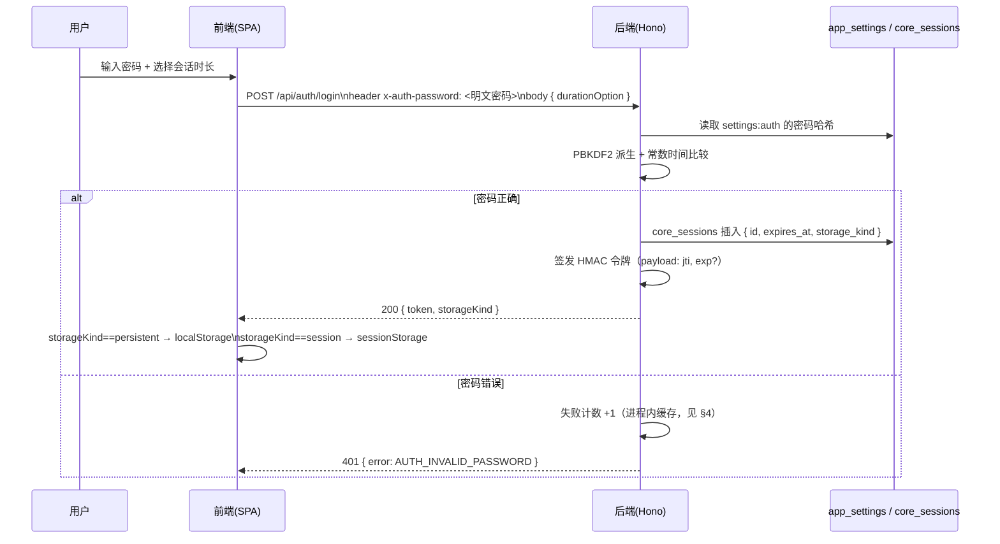

# Auth.md — 鉴权系统规范

对应
[`ARCHITECTURE.md §10`](../ARCHITECTURE.md#10-鉴权系统x-auth-password)。全局单密码鉴权，非多用户账号体系。

## 1. 登录时序



### 前端门控：未登录不渲染 AppShell

`main.js` 在无本地令牌时**不渲染 AppShell**（侧栏/头部对未认证用户不可见、不可
操作），而是渲染独立全屏登录页（`.login-standalone`，URL 同步为 `/login`）。
登录成功（`saveAuthToken` 触发 `auth:changed`）后装配 AppShell 并进入默认页；
会话失效（401 → `auth:unauthorized`）则拆除 AppShell 退回独立登录页。

## 2. 会话时长选择 UI → 存储映射

| UI 选项                              | `expires_at`                                          | 客户端存储                                                               |
| ------------------------------------ | ----------------------------------------------------- | ------------------------------------------------------------------------ |
| 4 / 8 / 12 / 24 小时                 | 签发时刻 + 对应时长                                   | `localStorage`（跨浏览器重启存活）                                       |
| 7 / 14 / 30 / 90 天                  | 同上                                                  | `localStorage`                                                           |
| 保持登录直到下次浏览器打开（大按钮） | `NULL`（不设服务端硬过期，或设 30 天兜底上限，见 §5） | `sessionStorage`（浏览器关闭即清除，语义上等价于"下次打开需要重新登录"） |

UI 布局为 2×4 网格 + 底部通栏大按钮，两者共用 `<ds-segmented-control>`（见
`Components.md §7`），仅数据源与提交后的存储策略不同。

## 3. 后续请求：`x-auth-password` 头的语义

**约定**（对应 `ARCHITECTURE.md §10.1` 与 §20 待确认项
#2）：登录请求本身，该头携带**明文密码**；登录成功之后的所有请求，**同一个头名**改为携带**签发出的会话令牌**，不再重复传输明文密码。

```
POST /api/auth/login          x-auth-password: <明文密码>
GET  /api/notes                x-auth-password: <会话令牌>
POST /api/notes                x-auth-password: <会话令牌>
```

> ⚠️
> 这是一个"忠实沿用你给定表头命名，但登录后语义切换为令牌"的折中设计，若你更倾向严格区分（登录后改用新头名
> `x-auth-token`），请在 `ARCHITECTURE.md §20` 明确，本文件与实现会同步调整。

## 4. 中间件校验逻辑

```js
// shared/auth/auth-middleware.js（伪代码，实际实现按此结构拆分为可测试的纯函数）
async function authMiddleware(c, next) {
  if (c.req.path === "/api/auth/login") return next();
  const token = c.req.header("x-auth-password");
  if (!token) {
    return c.json({ ok: false, error: { code: "AUTH_MISSING_TOKEN" } }, 401);
  }

  const payload = await verifyHmacToken(token); // 校验签名 + exp
  if (!payload) {
    return c.json({ ok: false, error: { code: "AUTH_INVALID_TOKEN" } }, 401);
  }

  const session = await getSessionCached(payload.jti); // 见 §6 缓存
  if (!session || session.revokedAt) {
    return c.json({ ok: false, error: { code: "AUTH_REVOKED" } }, 401);
  }

  c.set("sessionId", payload.jti);
  return next();
}
```

## 5. 登出

`POST /api/auth/logout`：将 `core_sessions.revoked_at`
置为当前时间；前端清除对应存储（`localStorage`/`sessionStorage`
里的令牌键）并跳转登录页。对应 `Components.md §5` 用户菜单第 4 项"退出登录"。

## 6. 登录失败限流（Brute-force 防护）

- 进程内缓存（`shared/cache/memory-cache.js`）按"失败次数 +
  最近失败时间"记录（键：固定值，因为是单密码系统，不区分 IP/用户，但仍记录来源
  IP 用于日志）。
- 阈值：连续失败 5 次后进入锁定，锁定时长指数退避：30s → 60s → 120s → … 封顶 30
  分钟。
- 锁定状态**同时**写入 `app_settings`（键 `settings:auth-lockout`，含
  `lockedUntil`
  字段），避免边缘运行时进程重启导致内存计数丢失、锁定被绕过；中间件校验时先查进程内缓存，未命中再查
  `app_settings`（见 `docs/decisions/` 的一致性 vs 成本取舍记录）。
- 登录成功后立即清除失败计数与锁定状态。

## 7. 令牌结构

```json
{ "jti": "<random-id>", "iat": 1735300000, "exp": 1735300000 }
```

`exp` 在"保持登录直到下次浏览器打开"场景下可省略或设置一个远期兜底值（如 30
天）——真正的"浏览器关闭即失效"由 `sessionStorage`
的生命周期保证，服务端令牌本身允许在那个时间窗内有效，这样即使令牌意外泄露到别处，也不会无限期有效。

## 8. 常数时间比较

密码哈希比较与令牌签名比较均使用 `shared/crypto/constant-time-compare.js`
提供的平台无关实现（本地/Docker 用 `node:crypto` 的 `timingSafeEqual`
等价能力，边缘运行时用手写常数时间字节比较），避免时序攻击探测密码/签名的部分正确性。
