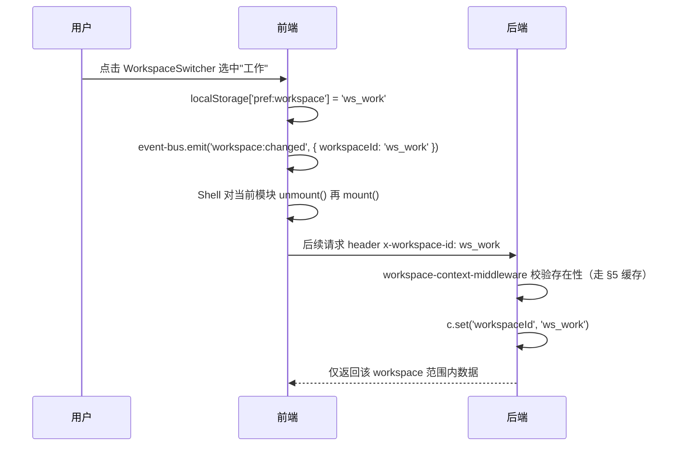

# Workspace.md — 工作空间与数据隔离

对应
[`ARCHITECTURE.md §7`](../ARCHITECTURE.md#7-工作空间workspace与数据隔离)。这是本模板**最高优先级的数据隔离边界**——任何新模块的数据模型设计都必须先读完本文件。

## 1. 概念

单一使用者（`x-auth-password`
单密码鉴权）在不同"情境"下维护互不干扰的数据集，等价于把 shadcn 示例的 Team
Switcher 语义收窄为个人多情境切换，而不是多租户协作。

## 2. 种子数据

见 [`ARCHITECTURE.md §7.2`](../ARCHITECTURE.md#7-工作空间workspace与数据隔离) 的
6 个系统工作空间表。种子迁移
`apps/server/src/shared/workspace/migrations/0001_seed.sql`：

```sql
INSERT INTO core_workspaces (id, name, icon, color_token, sort_order, is_system, created_at, updated_at) VALUES
  ('ws_default',       'i18n:workspace.seed.default',       'home',           'zinc', 0, 1, datetime('now'), datetime('now')),
  ('ws_work',          'i18n:workspace.seed.work',          'briefcase',      'zinc', 1, 1, datetime('now'), datetime('now')),
  ('ws_study',         'i18n:workspace.seed.study',         'graduation-cap', 'zinc', 2, 1, datetime('now'), datetime('now')),
  ('ws_life',          'i18n:workspace.seed.life',          'heart',          'zinc', 3, 1, datetime('now'), datetime('now')),
  ('ws_entertainment', 'i18n:workspace.seed.entertainment', 'gamepad-2',      'zinc', 4, 1, datetime('now'), datetime('now')),
  ('ws_travel',        'i18n:workspace.seed.travel',        'plane',          'zinc', 5, 1, datetime('now'), datetime('now'));
```

`i18n:` 前缀约定见 `i18n.md §5`。`color_token` 存语义色令牌名（当前统一
`zinc`，为未来"每个工作空间可选强调色"功能预留字段，不代表现在就要实现取色器）。

## 3. Repository 强制隔离封装器

```js
// shared/db/scoped-repository.js
export function createScopedRepository(db, table) {
  return {
    forWorkspace(workspaceId) {
      if (!workspaceId) {
        throw new Error(`workspaceId is required to access "${table}"`);
      }
      return {
        list: (extraWhere = "", extraParams = []) =>
          db.query(
            `SELECT * FROM ${table} WHERE workspace_id = ? ${extraWhere}`,
            [workspaceId, ...extraParams],
          ),
        findById: (id) =>
          db.query(`SELECT * FROM ${table} WHERE workspace_id = ? AND id = ?`, [
            workspaceId,
            id,
          ]).then((r) => r[0] ?? null),
        insert: (row) => {
          const cols = Object.keys(row);
          const placeholders = cols.map(() => "?").join(",");
          return db.execute(
            `INSERT INTO ${table} (workspace_id, ${
              cols.join(",")
            }) VALUES (?, ${placeholders})`,
            [workspaceId, ...cols.map((c) => row[c])],
          );
        },
        update: (id, patch) => {
          const cols = Object.keys(patch);
          const setClause = cols.map((c) => `${c} = ?`).join(", ");
          return db.execute(
            `UPDATE ${table} SET ${setClause} WHERE workspace_id = ? AND id = ?`,
            [...cols.map((c) => patch[c]), workspaceId, id],
          );
        },
        remove: (id) =>
          db.execute(`DELETE FROM ${table} WHERE workspace_id = ? AND id = ?`, [
            workspaceId,
            id,
          ]),
      };
    },
  };
}
```

`repository.js` 只能通过
`createScopedRepository(db, 'notes_data').forWorkspace(workspaceId)`
访问表，**不暴露不带 `forWorkspace` 的裸查询方法**——这是"业务代码无法遗漏
workspace 过滤"的结构性保证，`scripts/check-workspace-scope.js`
的正则扫描是兜底，不是第一道防线。

## 4. 前后端上下文传递



同时把最近使用的 workspace 冗余写入
`app_settings['settings:workspace']`，作为新设备/新会话下 `x-workspace-id`
缺失时的兜底默认值（`localStorage` 优先，`app_settings` 只是"新设备初始值"）。

## 5. 进程内缓存

`core_workspaces` 全量列表变更少、读取频繁（每请求的中间件都要校验
`x-workspace-id` 合法性），进程内缓存 TTL 建议
60s，写操作（新建/删除/重命名工作空间）后主动失效该缓存键，避免等 TTL
自然过期造成短暂不一致。

## 6. 新建 / 重命名 / 删除

- **新建**：`WorkspaceSwitcher` 下拉底部"新建工作空间"，表单仅需名称（必填）+
  图标（可选，默认 `folder`），`is_system=0`。
- **重命名/换图标**：系统工作空间（`is_system=1`）与自定义工作空间均可重命名/换图标；系统工作空间的
  `name` 一旦被用户手动改过，需要把 `i18n:`
  前缀替换为字面量（不再跟随语言切换，这是"用户主动覆盖了系统默认名"的合理预期）。
- **删除**：**仅**自定义工作空间可删除（`is_system=1` 的六个不可删除，UI
  上直接隐藏删除入口）。删除前用 `<ds-confirm-dialog danger>`
  二次确认；若该工作空间下仍有业务数据，进一步要求用户输入工作空间名称完成"破坏性确认"（参考常见的"输入仓库名以确认删除"模式），确认后**级联删除**该
  workspace 下所有模块的数据（否则会产生指向已删除 workspace
  的孤儿行）——级联删除的具体实现：后端提供一个 `DELETE /api/workspaces/:id`
  端点，遍历一份"已注册模块清单"（见 §7）依次调用各模块暴露的
  `deleteAllForWorkspace(workspaceId)` 能力（通过 §7
  的能力注册表调用，不是硬编码 import 每个模块）。

## 7. 模块如何参与工作空间生命周期

模块若持有需要随 workspace 删除而清理的数据，需要在自己的 `index.js`
里向能力注册表注册一个清理函数：

```js
// modules/notes/index.js
import { registerCapability } from "@shared/core/module-registry.js";
registerCapability("notes", {
  deleteAllForWorkspace: (workspaceId) =>
    notesService.deleteAllForWorkspace(workspaceId),
});
```

Workspace 删除流程通过
`getCapability(moduleId)?.deleteAllForWorkspace?.(workspaceId)`
遍历调用，模块未加载/未注册该能力时静默跳过（容错，见 `ARCHITECTURE.md §4.3`
能力注册表的懒加载语义）。

## 8. 测试清单（强制回归项）

1. **隔离性**：在工作空间 A 插入数据，切到工作空间 B
   查询同一张表，结果必须为空。
2. **默认回退**：请求缺失/携带非法 `x-workspace-id` 时，中间件回退到
   `ws_default` 而不是 500。
3. **删除级联**：删除自定义工作空间后，所有已注册模块的对应数据行清零，且
   `core_workspaces` 中该行本身也被删除。
4. **系统工作空间不可删**：对 6 个系统工作空间发起删除请求，返回
   400/403，而不是静默成功或 500。
5. **切换重挂载**：切换工作空间后，当前挂载模块的组件树被完全 unmount 再
   mount（可通过组件生命周期打点断言，不允许"看起来刷新了但内部状态是旧
   workspace 的残留"）。

对应的 `Deno.test` 模板见 `Testing.md §集成测试`。
